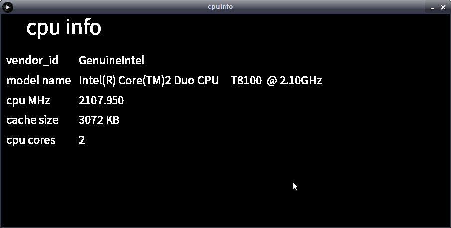

# cpuinfo


Cpuinfo disps your cpu's information on ubuntu.

like this

```
veprogramndor_id  : GenuineIntel
model name  : Intel(R) Core(TM)2 Duo CPU     T8100  @ 2.10GHz
cpu MHz    : 2108.309
cache size  : 3072 KB
cpu cores  : 2
```




##  How to execute

```
$tar xzf application.linux64.tar.gz
$cd application.linux64
$sh cpuinfo
```


You need java.

------

written in processing.

2020 May 24th
copyright by Ztaku


